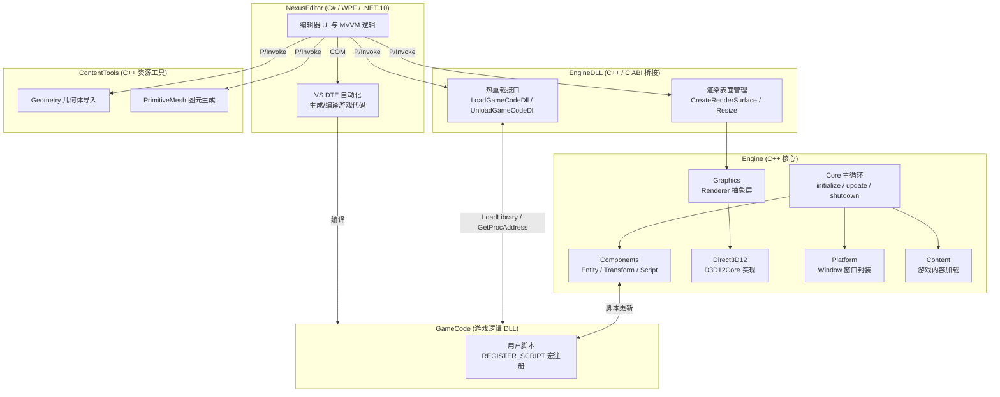
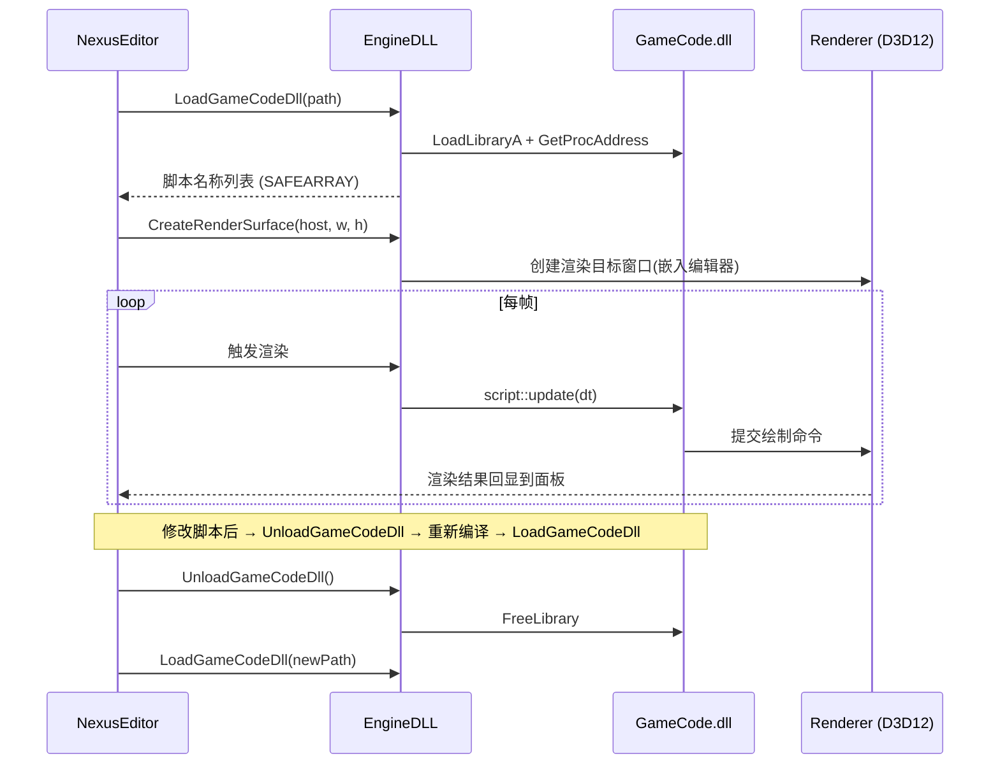
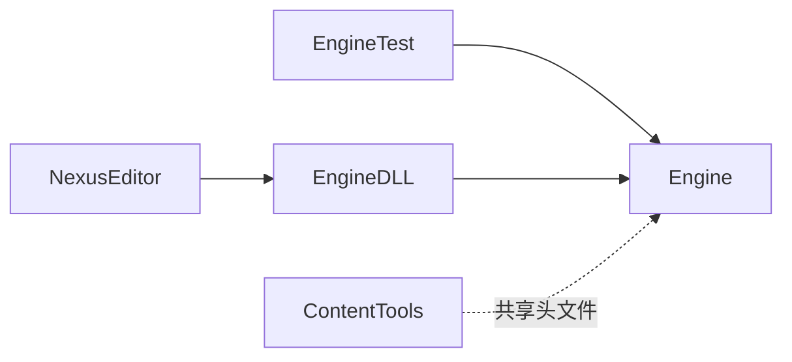

<div align="center">

# ⚙️ Nexus Engine

**跨平台 C++ 游戏引擎，采用 C++ 引擎核心 + C# WPF 编辑器架构，当前支持 Windows 平台，计划扩展至 Linux**

支持 DLL 热重载 · ECS 组件系统 · Direct3D12 渲染后端 · 可视化场景编辑


</div>

---

## 📖 简介

Nexus 是一个跨平台的游戏引擎，采用 **C++ 核心 + C# WPF 编辑器** 的混合架构。引擎核心以静态库形式提供运行时能力，游戏逻辑以独立 DLL 形式加载，配合编辑器实现 **运行时热重载**——修改脚本后无需重启即可即时生效。

项目以学习与探索现代引擎架构为目标，涵盖了窗口/平台抽象、ECS 实体组件系统、D3D12 图形后端、内容资源管线、脚本注册机制以及可视化编辑器等完整模块。

---

## ✨ 核心特性

- 🔥 **DLL 热重载** —— 游戏代码以 DLL 形式动态加载/卸载，编辑器内一键重载脚本，迭代零等待
- 🧩 **ECS 组件系统** —— 基于 Typed ID 的实体/组件设计，类型安全且缓存友好
- 🎨 **Direct3D 12 后端** —— 现代低开销图形 API，通过图形平台接口层抽象，便于扩展其他后端
- 🖥️ **可视化编辑器** —— C# WPF 构建，提供场景大纲、实体检视器、Transform 编辑、撤销/重做、日志面板
- 📦 **内容资源管线** —— 几何体导入、法线/切线计算、LOD 分组、顶点打包优化
- 🔷 **基础图元生成** —— 内置 Plane / Cube / UV Sphere / Ico Sphere / Cylinder / Capsule
- 🧱 **项目模板系统** —— 空白项目、第一人称、第三人称、俯视角等多种起步模板
- 🔗 **C++/C# 桥接** —— 通过 C ABI（`EDITOR_INTERFACE`）跨语言调用，SAFEARRAY 传递脚本元数据
- ⚙️ **VS DTE 集成** —— 编辑器通过 Visual Studio DTE 自动化生成与编译游戏代码

---

## 🏗️ 系统架构



### 运行时数据流



---

## 📂 项目结构

```
Nexus/
├── Engine/                      # 引擎核心 (C++ 静态库)
│   ├── Common/                  # 公共头文件、基础类型、Typed ID
│   │   ├── CommonHeaders.h
│   │   ├── PrimitiveTypes.h
│   │   └── Id.h
│   ├── Core/                    # 引擎主循环与入口
│   │   ├── Main.cpp             # WinMain 入口 (非编辑器模式)
│   │   └── Engine.cpp           # initialize / update / shutdown
│   ├── Platform/                # 平台与窗口抽象 (Windows API)
│   │   ├── Platform.h / Platform.cpp
│   │   ├── Window.h
│   │   └── PlatformTypes.h
│   ├── Components/              # ECS 组件
│   │   ├── Entity.h / Entity.cpp
│   │   ├── Transform.h / Transform.cpp
│   │   ├── Script.h / Script.cpp
│   │   └── ComponentsCommon.h
│   ├── EngineAPI/               # 对外公共 API
│   │   ├── GameEntity.h         # 实体 + 脚本注册宏 REGISTER_SCRIPT
│   │   ├── TransformComponent.h
│   │   └── ScriptComponent.h
│   ├── Graphics/                # 图形层
│   │   ├── Renderer.h / Renderer.cpp
│   │   ├── GraphicsPlatformInterface.h   # 后端抽象接口
│   │   └── Direct3D12/          # D3D12 实现
│   │       ├── D3D12Core.h / D3D12Core.cpp
│   │       ├── D3D12Interface.h / D3D12Interface.cpp
│   │       └── D3D12CommonHeaders.h
│   ├── Content/                 # 游戏内容加载
│   │   └── ContentLoader.h / ContentLoader.cpp
│   └── Utilities/               # 数学与工具
│       ├── Math.h / MathTypes.h
│       └── Utilities.h
│
├── EngineDLL/                   # 编辑器接口层 (C++ 动态库 / C ABI)
│   ├── EngineAPI.cpp            # 热重载 + 渲染表面管理
│   ├── EntityAPI.cpp            # 实体操作接口
│   ├── Common.h                 # EDITOR_INTERFACE 宏
│   └── dllmain.cpp
│
├── ContentTools/                # 资源处理工具 (C++ 动态库)
│   ├── Geometry.h / Geometry.cpp        # 几何体导入/LOD/顶点打包
│   ├── PrimitiveMesh.h / PrimitiveMesh.cpp  # 基础图元生成
│   └── ToolsCommon.h
│
├── EngineTest/                  # 引擎测试程序 (C++ 可执行)
│   ├── Main.cpp
│   ├── Test.h
│   ├── TestWindow.h
│   ├── TestRenderer.h / TestRenderer.cpp
│   └── TestEnlityComponents.h
│
├── NexusEditor/                 # 可视化编辑器 (C# / WPF / .NET 10)
│   ├── App.xaml / App.xaml.cs
│   ├── MainWindow.xaml
│   ├── Common/                  # MVVM 基础 (ViewModelBase, RelayCommand)
│   ├── GameProject/             # 项目管理 (新建/打开/场景)
│   ├── Editors/WorldEditor/     # 世界编辑器视图
│   │   ├── GameEntityView / ComponentView
│   │   ├── TransformView / ProjectLayoutView
│   ├── GameDev/                 # 脚本创建对话框
│   ├── Utilities/               # UndoRedo / Serializer / Logger
│   ├── Dictionaries/            # 样式与控件模板 (EditorColors)
│   ├── Resources/               # 图标与纹理资源
│   └── ProjectTemplates/        # 项目模板 (.nexus)
│       ├── EmptyProject/
│       ├── FirstProject/
│       ├── ThirdPersonProject/
│       └── TopDownPorject/
│
├── Nexus.slnx                   # 解决方案 (VS 2026 .slnx 格式)
├── LICENSE.txt                  # GPL-3.0
├── .gitignore
└── .gitattributes
```

---

## 🧠 技术亮点详解

### 1. DLL 热重载机制

游戏逻辑编译为独立 DLL，引擎通过 `LoadLibraryA` / `FreeLibrary` 动态加载。脚本通过 `REGISTER_SCRIPT` 宏在 DLL 加载时自动注册到全局表，编辑器通过哈希名查找并实例化。

```cpp
// 游戏代码侧：声明并注册脚本
class player_controller : public nexus::script::entity_script {
    void begin_play() override { /* ... */ }
    void update(float dt) override { /* ... */ }
};
REGISTER_SCRIPT(player_controller);

// 编辑器侧：运行时加载/卸载/重载
LoadGameCodeDll("GameCode.dll");     // 加载
GetScriptNames();                    // 枚举可用脚本 (SAFEARRAY → C#)
UnloadGameCodeDll();                 // 卸载（修改后）
LoadGameCodeDll("GameCode.dll");     // 重新加载新版本
```

### 2. ECS 组件系统

实体与组件均使用 `DEFINE_TYPED_ID` 生成强类型 ID，避免不同类型 ID 混用，同时保持数据局部性。组件通过 `create` / `remove` / `update` 接口管理生命周期。

### 3. 图形后端抽象

`GraphicsPlatformInterface` 定义了后端无关的函数指针接口（`initialize` / `shutdown` / `render`），当前实现为 Direct3D 12。切换图形后端只需实现该接口并注入，无需改动上层渲染逻辑。

### 4. C++ / C# 跨语言桥接

- **调用方向**：C# 编辑器 → P/Invoke → C ABI（`EDITOR_INTERFACE`，即 `extern "C" __declspec(dllexport)`）→ C++ 引擎
- **数据传递**：脚本名称列表通过 `LPSAFEARRAY` 传递，便于 C# 直接消费
- **窗口嵌入**：`CreateRenderSurface` 将引擎渲染窗口的 HWND 嵌入 WPF 面板，实现编辑器内实时预览

### 5. 内容资源管线

`ContentTools` 负责离线/编辑时资源处理：
- **Geometry**：导入网格数据，支持法线/切线自动计算、平滑角、手性翻转、LOD 分组
- **顶点打包**：`packed_vertex::vertex_static` 将法线/切线压缩为 `u16[2]`（八面体编码），显著降低顶点带宽
- **PrimitiveMesh**：参数化生成 6 种基础图元，支持分段数与尺寸配置

---

## 🚀 快速开始

### 环境要求

| 依赖 | 版本 |
|------|------|
| Visual Studio | 2026（MSVC v145 工具集）|
| .NET SDK | 10.0+ |
| Windows SDK | 10+（含 Direct3D 12）|
| 操作系统 | Windows 10 / 11 x64 |

### 构建步骤

1. **克隆仓库**

   ```bash
   git clone <repo-url> Nexus
   cd Nexus
   ```

2. **打开解决方案**

   使用 Visual Studio 2026 打开 `Nexus.slnx`（新版 XML 解决方案格式）。

3. **选择构建配置**

   | 配置 | 说明 |
   |------|------|
   | `Debug` | 独立运行模式（引擎 + 测试程序）|
   | `Release` | 独立运行模式（发布优化）|
   | `DebugEditor` | 编辑器模式（编译 EngineDLL + NexusEditor，定义 `USE_WITH_EDITOR`）|
   | `ReleaseEditor` | 编辑器模式（发布优化）|

4. **构建并运行**

   - **使用编辑器**：选择 `DebugEditor` 或 `ReleaseEditor`，将 `NexusEditor` 设为启动项目，生成并运行。
   - **独立运行游戏**：选择 `Debug` 或 `Release`，将 `EngineTest` 设为启动项目。

> 💡 编辑器模式下，`EngineDLL` 与 `ContentTools` 会作为动态库输出，供 `NexusEditor` 通过 P/Invoke 调用。

---

## 🛠️ 技术栈

| 领域 | 技术 |
|------|------|
| 核心语言 | C++ 20/23 |
| 编辑器语言 | C# 10 (.NET 10) |
| 图形 API | Direct3D 12 |
| 数学库 | DirectXMath |
| UI 框架 | WPF (MVVM) |
| 构建系统 | MSBuild / Visual Studio 2026 |
| 解决方案格式 | `.slnx` (XML) |
| 跨语言桥接 | C ABI (`extern "C"`) + P/Invoke + COM (EnvDTE) |
| 版本控制 | Git |

---

## 📌 项目模块依赖



- `Engine` 为底层核心，无外部项目依赖
- `EngineDLL` 依赖 `Engine`，向编辑器导出 C 接口
- `ContentTools` 独立编译，与 `Engine` 共享部分头文件
- `NexusEditor` 依赖 `EngineDLL` 的构建产物
- `EngineTest` 仅在非 Editor 配置下构建

---

## 📄 许可证

本项目基于 [**GNU General Public License v3.0**](./LICENSE.txt) 开源。

任何人可自由复制、修改与分发，但衍生作品必须同样以 GPL-3.0 许可发布，并附带源代码。

---

<div align="center">

**Nexus Engine** · 用于学习现代游戏引擎架构的实践项目

</div>
